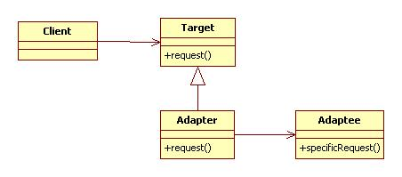
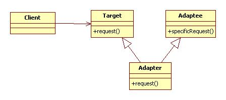

***************
Adapter Pattern
***************

Ducks
=====

Test
----

This project uses cmake so wide range of OSes are supported. For ubuntu, you can
compile as shown below::

 mkdir build
 cd build/
 cmake ../Ducks/
 make
 ./driver/testducks

Class Diagram
-------------

.. image:: Ducks/imgs/Overview_of_Ducks.jpg
   :scale: 50 %
   :alt: Class Diagram

Sequence Diagram
----------------

.. image:: Ducks/imgs/SequenceDiagram1.jpg
   :scale: 50 %
   :alt: Sequence Diagram

+------------------------------------------------------------------------------+
|패턴 8. 어댑터                                                                |
+==============================================================================+
|한 클래스의 인터페이스를 클라이언트에서 사용하고자 하는 다른 인터페이스로     |
|변환한다. 어댑터를 이용하면 인터페이스 호환성 문제 때문에 같이 쓸 수 없는     |
|클래스들을 연결해서 쓸 수 있다.                                               |
+------------------------------------------------------------------------------+

**객체 어댑터(StarUML 템플릿)**

**클래스 어댑터**

다중상속이 지양되는 바로 그 이유로 클래스 어댑터의 사용도 지양된다.
(일반적으로...)

