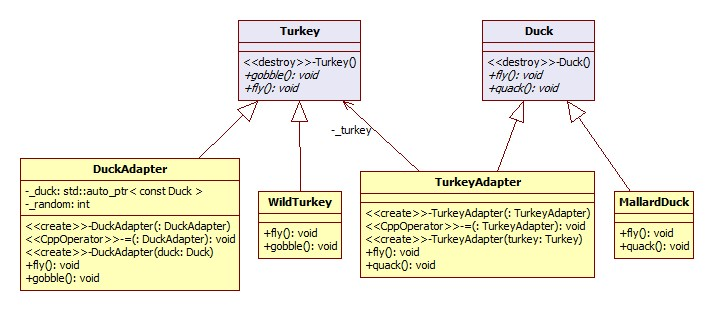

I want `Korean version <README.rst>`_.

***************
Adapter Pattern
***************

Ducks
=====

Class Diagram
-------------

Sequence Diagram
----------------

.. image:: Ducks/SequenceDiagram1.jpg
   :scale: 50 %
   :alt: Sequence Diagram

+------------------------------------------------------------------------------+
|Pattern 8. Adapter                                                            |
+==============================================================================+
|Convert the interface of a class that you want to use a different interface   |
|from a client. Interface compatibility problem, because classes can not be    |
|written as the adapter can use to connect.                                    |
+------------------------------------------------------------------------------+

**Object Adapter (StarUML Template)**

.. image:: Object_Adapter.jpg
   :scale: 50 %
   :alt: Class Diagram

**Class Adapter**

.. image:: Class_Adapter.jpg
   :scale: 50 %
   :alt: Class Diagram

Avoid multiple inheritance is avoided for that reason the use of the adapter
class.

