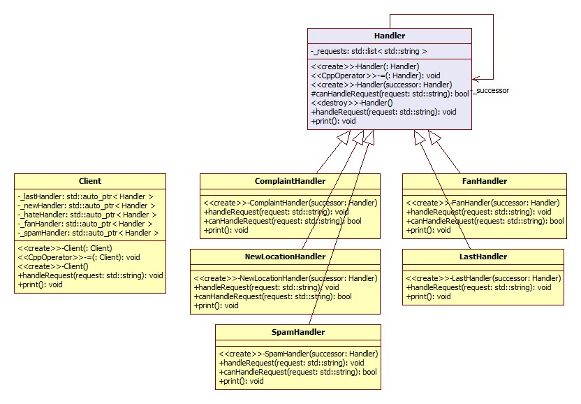
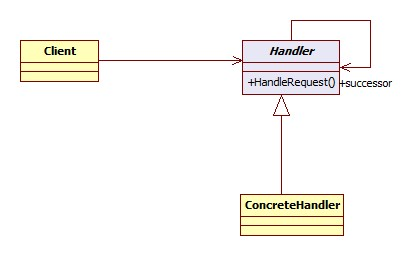

*******************************
Chain of responsibility Pattern
*******************************

GumballEMailHandler
===================

Test
----

This project uses cmake so wide range of OSes are supported. For ubuntu, you can 
compile as shown below::

 mkdir build
 cd build/
 cmake ../GumballEMailHandler/
 make
 ./driver/testhandlers

Class Diagram
-------------

Sequence Diagram
----------------

.. image:: GumballEMailHandler/imgs/SequenceDiagram1.jpg
   :scale: 50 %
   :alt: Sequence Diagram

+------------------------------------------------------------------------------+
|패턴 C. 역할사슬 패턴                                                         |
+==============================================================================+
|한 요청을 두 개 이상의 객체에서 처리하고 싶다면 역할 사슬 패턴을 사용하면     |
|됩니다.                                                                       |
+------------------------------------------------------------------------------+

