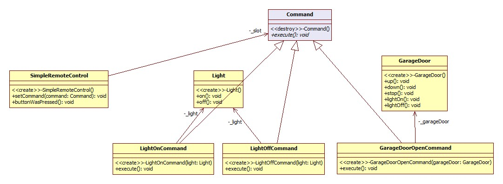
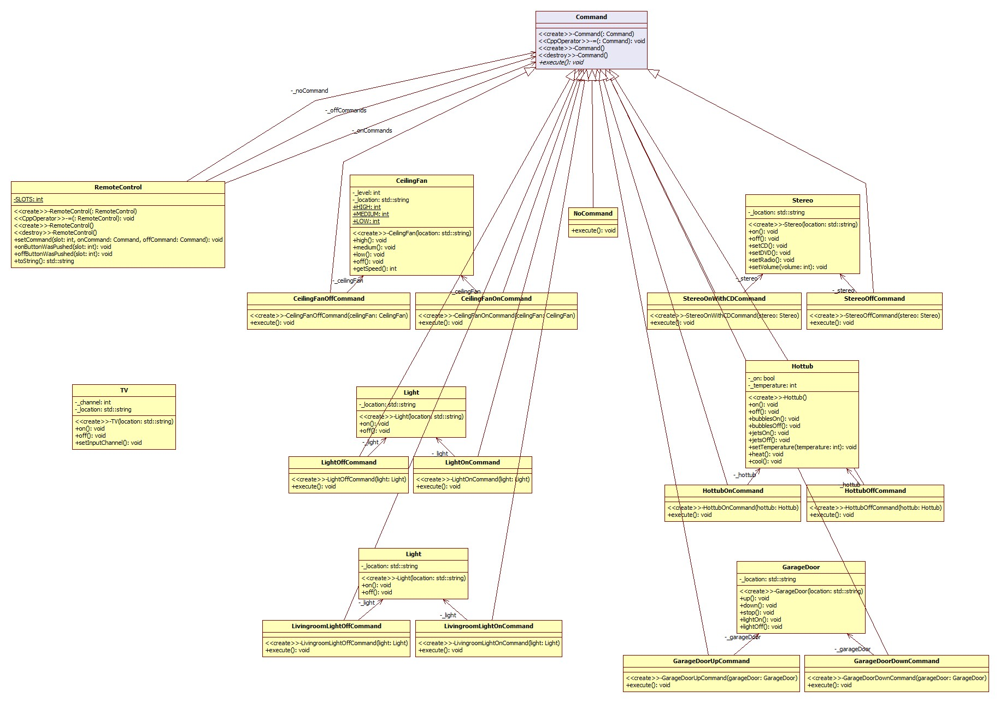
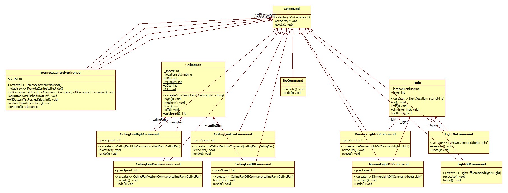

***************
Command Pattern
***************

Simple Remote Control
=====================

Class Diagram
-------------

Sequence Diagram
----------------

.. image:: SimpleRemote/SequenceDiagram1.jpg
   :scale: 50 %
   :alt: Sequence Diagram

================================================================================
패턴 7. 커맨드
================================================================================
요구사항 을 객체로 캡슐화 할 수 있으며, 매개변수를 써서 여러가지 다른 요구사항을
집어넣을 수도 있다. 또한 요청 내역을 큐에 저장하거나 로그로 기록할 수도 있으며,
작업 취소 기능도 지원 가능하다.
================================================================================

Remote Control
==============

Class Diagram
-------------

Sequence Diagram
----------------

.. image:: Remote/SequenceDiagram1.jpg
   :scale: 50 %
   :alt: Sequence Diagram

Undo
====

Class Diagram
-------------

Sequence Diagram
----------------

.. image:: Undo/SequenceDiagram1.jpg
   :scale: 50 %
   :alt: Sequence Diagram

