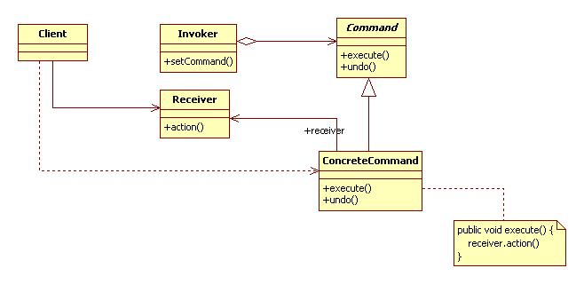

I want `Korean version <README.rst>`_.

***************
Command Pattern
***************

Simple Remote Control
=====================

Class Diagram
-------------

.. image:: SimpleRemote/Overview_of_SimpleRemote.jpg
   :scale: 50 %
   :alt: Class Diagram

Sequence Diagram
----------------

.. image:: SimpleRemote/SequenceDiagram1.jpg
   :scale: 50 %
   :alt: Sequence Diagram

+------------------------------------------------------------------------------+
|Pattern 7. Command                                                            |
+==============================================================================+
|Requirements can be encapsulated into objects and various other requirements, |
|using the parameters n2/n1Also may request details are stored in a queue or   |
|log to record the job cancel function support is available.                   |
+------------------------------------------------------------------------------+

Note : Meta Command Pattern (Creating a macro command, consisting of the number
of commands to run at once.)

Note : ConcreteCommand Invoker in setCommand() which creates an object client.

Remote Control
==============

Class Diagram
-------------

.. image:: Remote/Overview_of_Remote.jpg
   :scale: 50 %
   :alt: Class Diagram

Sequence Diagram
----------------

.. image:: Remote/SequenceDiagram1.jpg
   :scale: 50 %
   :alt: Sequence Diagram

**null object - Pattern Encouragement Award**

Apparent null handle the client-side so that you do not want to, you can take
advantage of a null object, but the object to be returned. In the above case is
the use of class NoCommand

Undo
====

Class Diagram
-------------

.. image:: Undo/Overview_of_Undo.jpg
   :scale: 50 %
   :alt: Class Diagram

Sequence Diagram
----------------

.. image:: Undo/SequenceDiagram1.jpg
   :scale: 50 %
   :alt: Sequence Diagram

* Undo functionality in addition to the macro command object may be used. (A
  sample of the remote control Party mode)
* Process or thread pool in pools or scheduler can take advantage of.
* Command class to load (), store () function by adding a log-based recovery
  system Can be used to implement the transaction by taking advantage of all
  work perfectly Nothing to be processed, or otherwise handled to prevent
  rollback Can be used to implement the functionality.

