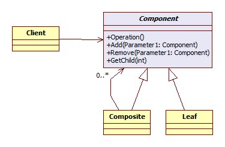

*****************
Composite Pattern
*****************

MenusCustomIterator
===================

Test
----

This project uses cmake so wide range of OSes are supported. For ubuntu, you can 
compile as shown below::

 mkdir build_MenusCustomIterator
 cd build_MenusCustomIterator/
 cmake ../MenusCustomIterator/
 make
 ./driver/testmenuscustomiterator

 mkdir build_Menus
 cd build_Menus/
 cmake ../Menus/
 make
 ./driver/testmenus

+------------------------------------------------------------------------------+
|패턴 12. 컴포지트                                                             |
+==============================================================================+
|컴포지트 패턴을 이용하면 객체들을 트리 구조로 구성하여 부분과 전체를 나타내는 |
|계층 구조로 만들 수 있으며, 클라이언트에서 개별 객체와 다른 객체들로 구성된   |
|복합 객체(composite)를 똑같은 방법으로 다룰 수 있다.                          |
+------------------------------------------------------------------------------+

Class Diagram
-------------

.. image:: MenusCustomIterator/imgs/Overview_of_Menus_Custom_Iterator.jpg
   :scale: 50 %
   :alt: Class Diagram

Sequence Diagram
----------------

.. image:: MenusCustomIterator/imgs/SequenceDiagram1.jpg
   :scale: 50 %
   :alt: Sequence Diagram

주의 : 컴포지트 패턴은 Component 에서 Leaf 와 Composite 를 위한 인터페이스를
모두 포함하고 있기 때문에 하나의 클래스가 두 개의 역할을 맡게 되고 이것이 단일
역할의 원칙을 위배하고 있다고 볼 수도 있다. 컴포지트 패턴은 실제로 ``단일 역할의
원칙`` 을 위배하는 대신 투명성을 추구하는 패턴이다. 여기서의 투명성이란
클라이언트 입장에서 복합객체와 잎 노드를 똑같은 Component 라는 인터페이스를 통해
처리 하므로써 어떤 원소가 복합객체인지 잎 노드인지가 클라이언트 입장에서는
투명하게 느껴지는 것이다.
Component 클래스에는 두 종류의 기능이 들어있다 보니까 안전성이 다소 떨이지게
된다. 클라이언트가 어떤 원소에 대해서는 무의미하거나 부적절한 작업을 처리하려고
할 수 있기 때문이다. 하지만 이렇게 단일 역할의 원칙을 어기는 것은 일종의
디자인상의 결정사항이다.(트레이드 오프가 있다는 뜻?!) 다른 방향에서 디자인해서
(즉, 단일 역할의 원칙에 따라서 디자인) 각 역할별로 클래스를 구분할 수도 있을
것이다. 이렇게 하면 어떤 원소에 대해 부적절한 처리를 시도하려거나 하는 문제는
없어질 것이다. 하지만 대신에 투명성이 떨어지게 되고 코드중에 조건문이나
instanceof 연산자(자바에서) 같은 것들이 필요해 지게 된다.
컴포지트 패턴은 또한 상황에 따라 원칙을 적절히 사용해야 한다는 것의 대표사례가
되기도 한다. 디자인 패턴의 가이드라인을 따르는 것 보다 때로는 그에 위배되는
방식으로 디자인하는 것이 필요하기도 하다.
하지만 컴포지트 패턴의 잎 노드를 자식이 0개인 복합 객체라고 본다면 이런 해석과
달리 볼 수도 있다! (단일 역할 원칙을 지키는 것이다!)

print 메소드에서 사용된 반복자는 구성 요소의 각 항목에 대해 일을 처리하고
구성요소가 Menu 인 경우에는 재귀적으로 print 를 호출해서 작업을 처리한다. 즉
MenuComponent (의 함수 print(), 정확하게는 Menu::print()) 내부에서 반복작업을
알아서 처리했다. (``내부 반복자``) 여기에 ``외부 반복자`` 를 사용하는 방식을
추가로 구현해 본 것이 책에 소개되어 있다. (C++ 샘플 코드는 구현치 않았다. 기존
샘플에 버그가 많기 때문이다. (메모리 유출이 많아 보인다)) 외부 반복자를 쓸 때는
반복중 현재 위치를 관리 해야한다. 그래야 클라이언트에서 hasNext, next 를 호출해서
원하는 반복작업을 할 수 있기 때문이다. 이 경우에는 **스택** 을 써서 재귀적인
구조에서의 복합객체에서의 현재 위치를 관리할 수 있다.

Composite Pattern which has external Iterator
--------------------------------------------------------------

.. image:: Composite_with_Iterator.jpg
   :scale: 50 %
   :alt: GoF's Composite Pattern + Iterator Pattern

``외부 반복자`` 이므로 Client 에서 Iterator 로 가는 연관관계를 그려넣었다.

널반복자는 ``널객체 디자인 패턴`` 이 적용된 사례가 된다. 그리고
printBegetarianMenu 메소드에서 try/catch 구조를 사용한 것은 Menu 와 MenuItem을
똑같이 다룸으로써 투명성을 높이기 위함이다. 그런데 이는 try/catch 의 원래 용도에
맞는 사용법은 아니다. C++ 에서는 RTTI 를 쓸 수 있다. 또는 RTTI 의 사용을 피하기
위해 LLVM 스타일의 RTTI 를 도입할 수도 있다.

컴포지트 패턴의 가장 큰 장점은 클라이언트를 단순화 시킬 수 있다는 것이다.
클라이언트는 복합객체를 사용하고 있는지 잎 객체를 사용하고 있는지에 대해서 전혀
신경쓰지 않아도 된다. 올바른 객체에 대해 올바른 연산을 적용하고 있는지 확인하기
위해 if 문을 지저분하게 여기저기 사용하지 않아도 된다. 그리고 하나의 메소드를
호출하면 전체 구조에 대해서 반복해서 작업을 처리할 수도 있다.

Continue to `Iterator Pattern <../Iterator>`_

