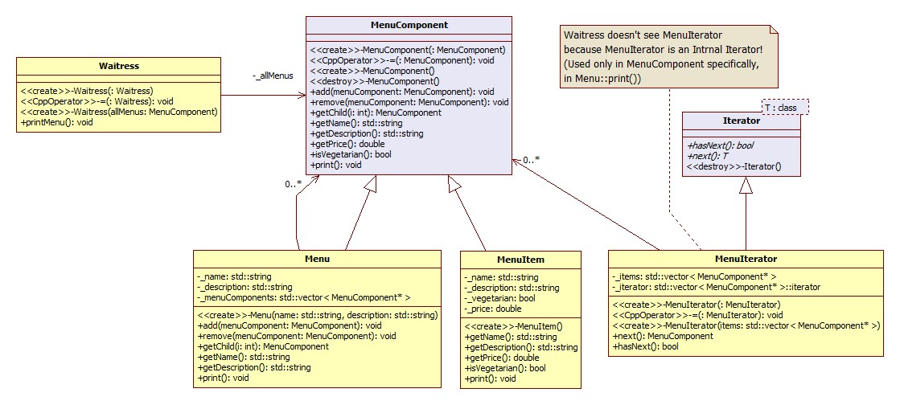

I want `Korean version <README.rst>`_.

*****************
Composite Pattern
*****************

MenusCustomIterator
===================

+------------------------------------------------------------------------------+
|Pattern 12. Composite                                                         |
+==============================================================================+
|Can be handled the same way as individual objects composed of other objects   |
|and composite objects organized in a tree structure of objects into a         |
|hierarchy that represents the part and the whole, you can create a composite  |
|pattern from the client.                                                      |
+------------------------------------------------------------------------------+

.. image:: Composite.jpg
   :scale: 50 %
   :alt: GoF's Composite Pattern

Class Diagram
-------------

Sequence Diagram
----------------

.. image:: MenusCustomIterator/SequenceDiagram1.jpg
   :scale: 50 %
   :alt: Sequence Diagram

Note : Leaf and Composite Component in the Composite pattern for interface
One of the classes and assume the role of the two because it includes all that
it violates the principle of a single role and can be seen. Composite pattern is
a pattern that actually violates the principle of a single role instead of
pursuing transparency. Of transparency here doing processing via Component,
composite objects with the same leaf node interface from the client perspective,
any element is a composite object is a leaf node, client positions in
transparent feel.
Component class contains two kinds of features are, after all, the safety will
drop somewhat. Is irrelevant or inappropriate for any element you can try to
handle the task because a client. But not violate the principle of a single role
is the sort of design decisions. Design in a different direction and each role
will be to distinguish between the classes. Doing so would be of no problem for
some elements to improper handling or attempting Instanceof operator conditional
or need the same things during the fall, but instead of transparency and code
becomes
Composite patterns are also typical examples of what principles should be used
appropriately depending on the situation. Than to follow the guidelines of a
design pattern to design in a manner that violates their sometimes may be
necessary.
Contrast with this interpretation a child if you object called private compound,
but the leaf nodes of the composite pattern can be seen.
processing work items for each of the components used in the print method
iterator
Components if the Menu is invoked recursively print job processing. Namely
Take care of repetitive tasks on the internal MenuComponent. Here to add a way
to use external iterators to implement this in the book, has been introduced.
When you write an external iterator repeat of the current position must be
managed. HasNext, next to the call from the client, so that the repetitive tasks
you want because you can. In this case, you can manage the stack using recursive
structure of composite objects at the current location of the

Composite Pattern which has external Iterator
--------------------------------------------------------------

.. image:: Composite_with_Iterator.jpg
   :scale: 50 %
   :alt: GoF's Composite Pattern + Iterator Pattern

``외부 반복자`` 이므로 Client 에서 Iterator 로 가는 연관관계를 그려넣었다.

널반복자는 ``널객체 디자인 패턴`` 이 적용된 사례가 된다. 그리고
printBegetarianMenu 메소드에서 try/catch 구조를 사용한 것은 Menu 와 MenuItem을
똑같이 다룸으로써 투명성을 높이기 위함이다. 그런데 이는 try/catch 의 원래 용도에
맞는 사용법은 아니다. C++ 에서는 RTTI 를 쓸 수 있다. 또는 RTTI 의 사용을 피하기
위해 LLVM 스타일의 RTTI 를 도입할 수도 있다.

컴포지트 패턴의 가장 큰 장점은 클라이언트를 단순화 시킬 수 있다는 것이다.
클라이언트는 복합객체를 사용하고 있는지 잎 객체를 사용하고 있는지에 대해서 전혀
신경쓰지 않아도 된다. 올바른 객체에 대해 올바른 연산을 적용하고 있는지 확인하기
위해 if 문을 지저분하게 여기저기 사용하지 않아도 된다. 그리고 하나의 메소드를
호출하면 전체 구조에 대해서 반복해서 작업을 처리할 수도 있다.

Continue to `Iterator Pattern <../Iterator>`_

