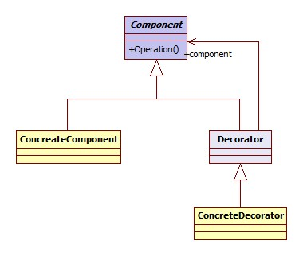

*****************
Decorator Pattern
*****************

Starbuzz
========

+------------------------------------------------------------------------------+
|디자인 원칙 - OCP (Open-Closed Principle)                                     |
+==============================================================================+
|클래스는 확장에 대해서는 열려 있어야 하지만 코드 변경에 대해서는 닫혀 있어야  |
|한다.                                                                         |
+------------------------------------------------------------------------------+

+------------------------------------------------------------------------------+
|패턴 3. 데코레이터                                                            |
+==============================================================================+
|객체에 추가적인 요건을 동적으로 첨가한다. 데코레이터는 서브클래스를 만드는    |
|것을 통해서 기능을 유연하게 확장할 수 있는 방법을 제공한다.                   |
+------------------------------------------------------------------------------+

Class Diagram
-------------

.. image:: Menus/Overview_of_Starbuzz.jpg
   :scale: 50 %
   :alt: Class Diagram

Sequence Diagram
----------------

.. image:: Menus/SequenceDiagram1.jpg
   :scale: 50 %
   :alt: Sequence Diagram

