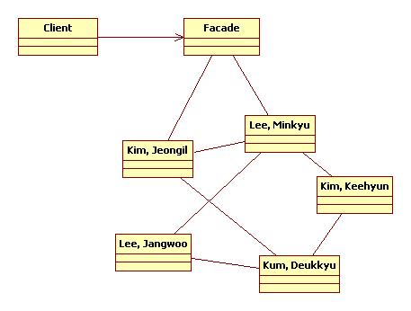

**************
Facade Pattern
**************

HomeTheater
===========

Class Diagram
-------------

.. image:: HomeTheater/Overview_of_HomeTheater.jpg
   :scale: 50 %
   :alt: Class Diagram

Sequence Diagram
----------------

.. image:: HomeTheater/SequenceDiagram1.jpg
   :scale: 50 %
   :alt: Sequence Diagram

+------------------------------------------------------------------------------+
|패턴 9. 퍼사드                                                                |
+==============================================================================+
|어떤 서브시스템의 일련의 인터페이스에 대한 통합된 인터페이스를 제공한다.      |
|퍼사드에서 고수준 인터페이스를 정의하기 때문에 서브시스템을 더 쉽게 사용할 수 |
|있다.                                                                         |
+------------------------------------------------------------------------------+

+------------------------------------------------------------------------------+
|디자인 원칙 - 최소지식 원칙(데메테르의 법칙)                                  |
+==============================================================================+
|정말 친한 친구하고만 이야기 하라!                                             |
+------------------------------------------------------------------------------+

최소지식 원칙을 지키기 위한 가이드 : 어떤 메소드에서든지 다음 네 종류의 객체의
메소드만을 호출하면 된다.

* 객체 자체의 메소드
* 메소드에 매개변수로 전달된 객체의 메소드
* 그 메소드에서 생성하거나 인스턴스를 만든 객체의 메소드
* 그 객체에 속하는(포함되는) 구성요소(객체)의 메소드

**절대 금물 : 어떤 메소드를 호출한 결과로 리턴받은 객체에 있는 메소드를 호출하는
것!!**

