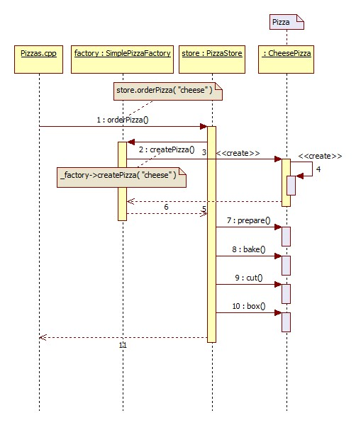
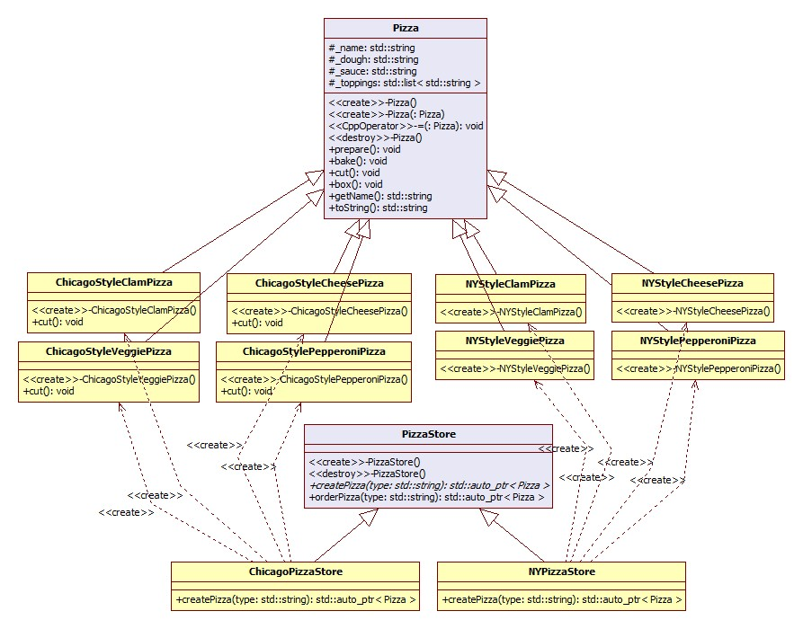
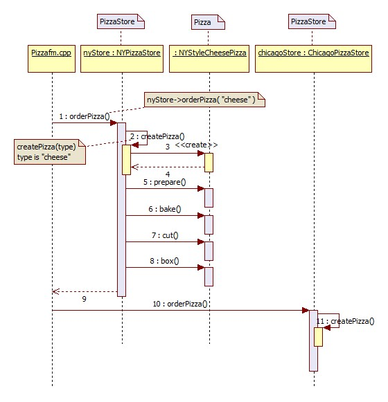
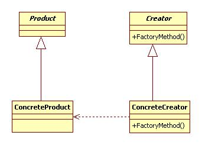
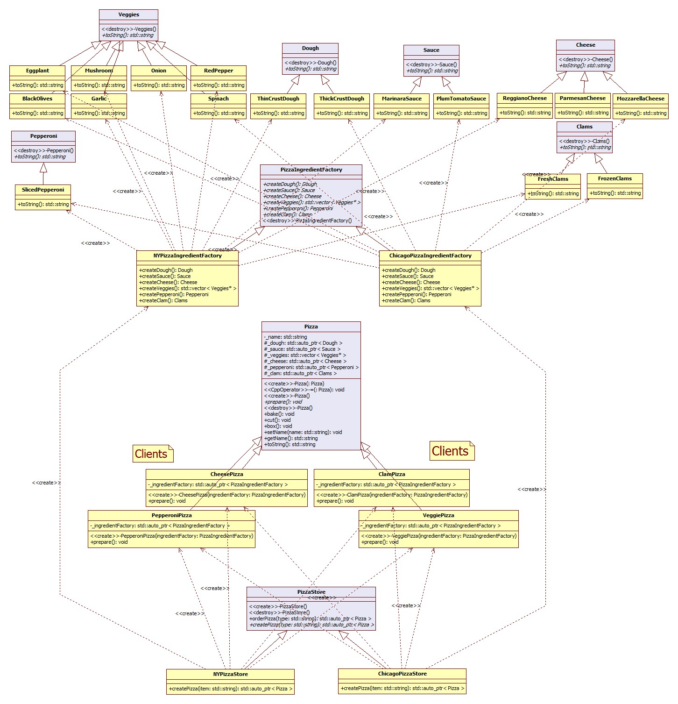

***************
Factory Pattern
***************

Test
----

This project uses cmake so wide range of OSes are supported. For ubuntu, you can 
compile as shown below::

 mkdir build_Pizzaaf
 cd build_Pizzaaf/
 cmake ../Pizzaaf/
 make
 ./driver/testpizzaaf

 mkdir build_Pizzafm
 cd build_Pizzafm/
 cmake ../Pizzafm/
 make
 ./driver/testpizzafm

 mkdir build_Pizzaas
 cd build_Pizzaas/
 cmake ../Pizzaas/
 make
 ./driver/testpizzaas

Simple Static Factory Method
============================

간단한 팩토리 - 패턴 장려상

Class Diagram
-------------

.. image:: Pizzas/imgs/Overview_of_SimpleFactory.jpg
   :scale: 50 %
   :alt: Class Diagram

Sequence Diagram
----------------

SimplePizzaFactory 클래스는 팩토리로써 위 애플리케이션에서 유일하게 Pizza 의
구상클래스를 직접 참조하는 부분이다.

**이런 메소드(SimplePizzaFactory::createPizza())를 static 메소드로 선언하는
경우가 종종 있다.**

Factory Method
==============

Class Diagram
-------------

Sequence Diagram
----------------

+------------------------------------------------------------------------------+
|패턴 4. 팩토리 메소드                                                         |
+==============================================================================+
|객체를 생성하기 위한 인터페이스를 정의하는데, 어떤 클래스의 인스턴스를        |
|만들지는 서브클래스에서 결정하게 만든다. 팩토리 메소드 패턴을 이용하면        |
|클래스의 인스턴스를 만드는 일을 서브클래스에게 맏기게 된다.                   |
+------------------------------------------------------------------------------+

Q : 간단한 팩토리와 팩토리 메소드 패턴의 차이점

A : 간단한 팩토리는 1회용 처방에 불과한 반면, 팩토리 메소드 패턴을 사용하면 어떤
구현을 사용할지를 서브클래스에서 결정하는 프레임워크를 만들 수 있다는 결정적인
차이점이 있다. 예를 들어, 팩토리 메소드 패턴에서 사용한 orderPizza() 메소드에서는
피자를 만들기 위한 일반적인 프레임워크를 제공한다. 그 프레임워크에서는 팩토리
메소드를 사용하여 구상클래스의 객체를 생성한다. PizzaStore 클래스의 서브클래스를
만들 때, 어떤 구상 제품 클래스로부터 orderPizza() 에서 리턴할 피자를 만들지
결정하게 된다. 간단한 팩토리에서는 객체 생성을 캡슐화 하기는 하지만 팩토리 메소드
패턴처럼 강력한 유연성을 지닌 프레임워크를 제공하진 못한다. 생성하는 제품을
마음대로 변경할 수 없기 때문이다.

+------------------------------------------------------------------------------+
|디자인 원칙 - 의존성 뒤집기 (Dependency Inversion Principle)                  |
+==============================================================================+
|추상화된 것에 의존하도록 만들어라. 구상 클래스에 의존하도록 만들지 않도록     |
|한다.                                                                         |
+------------------------------------------------------------------------------+

* **어떤 변수에도 구상 클래스에 대한 레퍼런스를 저장하지 말라**
new 연산자를 사용하면 구상 클래스에 대한 레퍼런스를 사용하게 되는 것이다.
팩토리를 써서 구상 클래스에 대한 레퍼런스를 변수에 저장하는 일을 미리 방지하라.

* **구상 클래스에서 유도된 클래스를 만들지 말라**
구상 클래스에서 유도된 클래스를 만들면 특정 구상 클래스에 의존하게 된다.
인터페이스나 추상클래스처럼 추상화된 것으로부터 클래스를 만들어야 한다.

* **베이스 클래스에 이미 구현되어 있던 메소드를 오버라이드하지 말라**
이미 구현되어있는 메소드를 오버라이드한다는 것은 애초부터 베이스클래스가 제대로
추상화된 것이 아니었다고 볼 수 있다. 베이스 클래스에서 메소드를 정의할 때는 모든
서브 클래스에서 공유할 수 있는 것만 정의해야 한다.

*물론 이는 가이드라인일 뿐이다. 합당한 이유가 있는 경우에는 의도적으로 이
가이드라인을 지키지 않기로 선택할 수 있다.
예를 들면, 자바의 String 클래스와 같은 경우 거의 변경이 발생하지 않을 것으로
예상되므로 팩토리를 사용하지 않고 직접 만들어서 사용할 수 있는 것이다!*

**OCP(Open-Closed Principle)**

.. image:: OCP_in_FactoryMethod.jpg
   :scale: 50 %
   :alt: Class Diagram

책에서 설명하지 않는 내용이지만 Factory Method 패턴에서는 **OCP
(Open-Closed Principle)** 을 발견할 수 있다. 위 그림의 우측편의 의존관계는 책에서
설명하지 않지만 중요해 보인다. 즉, 이는 변화에 ``닫힌(Closed)`` **프레임워크** 를
구현한다. 반면, 위 그림의 좌측편의 의존관계는 하나의 구상클래스가 다른
구상클래스를 생성하는 의존관계인데 이는 새로운 확장에 ``열려(Open)`` 있어
**어플리케이션** 에서 마음대로 새로운 내용을 추가할 수 있다. 이는 위의
PizzaStore의 클래스 다이어그램에서도 PizzaStore 와 Pizza 간의 의존관계가 생략되어
있으며 이를 포함해 동일하게 설명할 수 있다.

Abstract Factory
================

Class Diagram
-------------

* **PizzaIngredientFactory** : ``Abstract Factory`` in Abstract Factory Pattern
* **PizzaStore** : ``Creator`` in Factory Method Pattern
* **각 구상 Pizza 클래스들** : ``Client`` in Abstract Factory Pattern

Sequence Diagram
----------------

.. image:: Pizzaaf/imgs/SequenceDiagram1.jpg
   :scale: 50 %
   :alt: Sequence Diagram

+------------------------------------------------------------------------------+
|패턴 5. 추상 팩토리                                                           |
+==============================================================================+
|인터페이스를 이용하여 서로 연관된, 또는 의존하는 객체를 구상 클래스를 지정하지|
|않고도 생성할 수 있다.                                                        |
+------------------------------------------------------------------------------+

.. image:: AbstractFactory.jpg
   :scale: 50 %
   :alt: A Facade

+--------------------------------------+---------------------------------------+
|팩토리 메소드 패턴                    |추상 팩토리 패턴                       |
+======================================+=======================================+
|상속한 팩토리클래스를 사용해서 객체   |전달받은(구성) 팩토리객체를 사용해서   |
|생성                                  |객체 생성                              |
+--------------------------------------+---------------------------------------+
|간단한 인터페이스 - 하나의 팩토리     |제품 군을 생성 - 인터페이스가 큰 편,   |
|메소드 - **장점**                     |팩토리가 생성하는 제품군에 제품을      |
|                                      |추가하는 경우 인터페이스의 변경이      |
|                                      |불가피하다. - **단점**                 |
+--------------------------------------+---------------------------------------+
|객체 생성을 캡슐화해서 애플리케이션의 결합을 느슨하게 만들고, 특정 구현에 덜  |
|의존하도록 만들 수 있음.                                                      |
+------------------------------------------------------------------------------+

