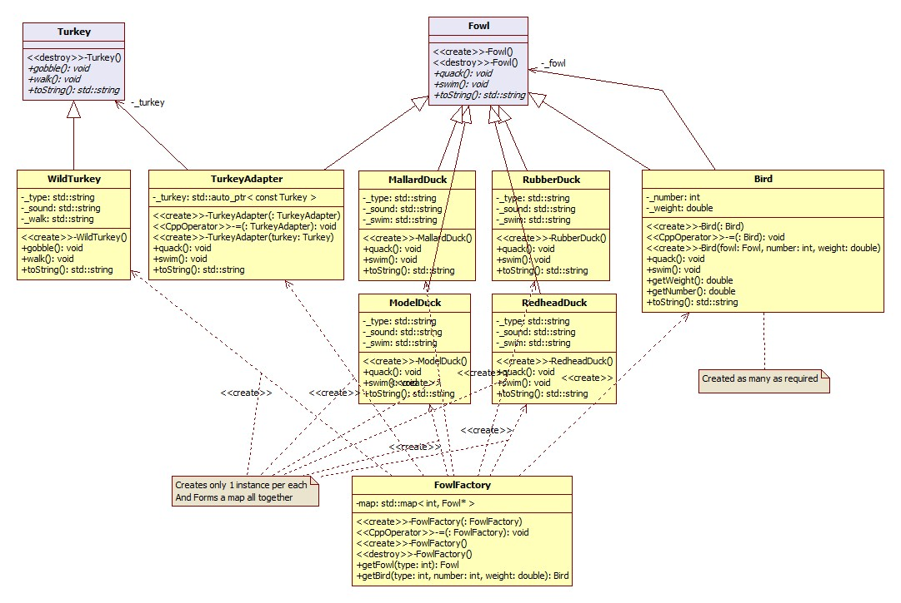

*****************
Flyweight Pattern
*****************

FowlWeight
==========

Class Diagram
-------------

+------------------------------------------------------------------------------+
|패턴 C. 플라이급패턴                                                          |
+==============================================================================+
|어떤 클래스의 인스턴스 한 개만 가지고 여러 개의 **가상 인스턴스** 를 제공하고 |
|싶다면 플라이웨이트 패턴을 사용하면 됩니다.                                   |
+------------------------------------------------------------------------------+

**장점**

* 실행시에 객체 인스턴스의 개수를 줄여서 메모리를 절약할 수 있다.
* 여러 **가상** 객체의 상태를 한 곳에 집중시켜놓을 수 있다.

**사용법 및 단점**

* 어떤 클래스의 인스턴스가 아주 많이 필요하지만 모두 똑같은 방식으로 제어할 수
  있는 경우에 유용하다.

* 일단 이 패턴을 써서 구현해놓고 나면 특정 인스턴스만 다른 인스턴스와 다른 식으로
  행동하도록 하는 것이 불가능하다는 단점이 있다.

*가상의 객체의 리소스 관리가 또 하나의 고민거리가 되겠다. 이는 레퍼런스 카운트
기반의 스마트 포인터가 필요한 최적의 모델이 아닐까?*

