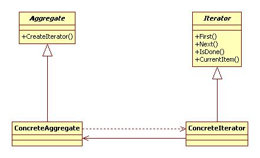

*****************
Iterator Pattern
*****************

DinerMergerI
=============

Class Diagram
-------------

.. image:: DinerMergerI/Overview_of_DinerMergerI.jpg
   :scale: 50 %
   :alt: Class Diagram

Sequence Diagram
----------------

.. image:: DinerMergerI/SequenceDiagram1.jpg
   :scale: 50 %
   :alt: Sequence Diagram

+------------------------------------------------------------------------------+
|패턴 11. 이터레이터                                                           |
+------------------------------------------------------------------------------+
|컬렉션 구현 방법을 노출시키지 않으면서도 그 집합체 안에 들어있는 모든 항목에  |
|접근할 수 있게 해 주는 방법을 제공한다.                                       |
+------------------------------------------------------------------------------+

주의 : Iterator 인터페이스에서 선언하는 메소드 이름은 전통적으로 First, Next,
IsDone, CurrentItem 등이었지만, 최근의 경향은 next, hasNext, remove 등을
사용하는 것이 대세이다. first 가 없어진 것은 자바에서는 처음부터 다시 돌리고
싶은 경우 그냥 반복자를 새로 만드는 방식을 주로 사용하기 때문이다....

본문의 Iterator 는 ``외부 반복자`` 이다. 클라이언트가 next 를 호출하며 반복작업을
제어하기 때문이다. 반면 ``내부 반복자`` 는 반복자 자신에 의해서 반복작업이
제어된다.
즉, 클라이언트가 반복자한테 어떤 작업을 넘겨줘야 한다. 내부 반복자를 쓰면
클라이언트가 반복작업을 마음대로 제어할 수 없기 때문에 외부 반복자를 쓰는
경우보다 유연성이 조금 떨어지게 되는데 작업을 반복자에게 완전 위임할 수 있어서
오히려 이점이 장점이 되기도 한다.

+------------------------------------------------------------------------------+
|디자인 원칙 - 단일 역할의 원칙                                                |
+------------------------------------------------------------------------------+
|클래스를 바꾸는 이유는 한 가지 뿐이어야 한다.                                 |
+------------------------------------------------------------------------------+

하나의 클래스가 수행하는 역할은 곧 그 역할에 변화가 발생할 때 그 클래스에도
변화를 불러오는 이유가 되게 된다.
하나의 클래스가 관련 없는 두가지 이상의 역할을 맡게 된다면 역할의 수 만큼 그
클래스가 변경될 경우의 수를 늘리게 된다.
하나의 클래스가 수행하는 역할을 한가지로 했을 때 응집도가 높은 좋은 디자인을
얻을 수 있게된다.

집합체에 내부 컬렉션과 관련된 기능과 반복자용 메소드관련 기능이 전부 구현된다면
``단일 역할의 원칙`` 에 위배된다.

*몇가지 책에 없는 이야기를 하자면,* **구상 Aggregate 객체** *는* ``Last long &
Unique`` *하지만* **구상 Iterator 객체** *는* ``Prompt, Frequent 그리고 Multiply
하게 생성됐다가 소멸`` *한다는 것이다. 또* **C++ 에서는 Iterator 클래스는
Aggregate 클래스의** ``Friend`` **클래스로 구현하면 좋겠다** *는 것이다. 관련된
이야기가 더 있는지 궁금하다.*

Continue to `Composite Pattern <../Composite>`_

