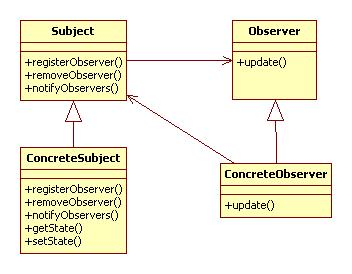
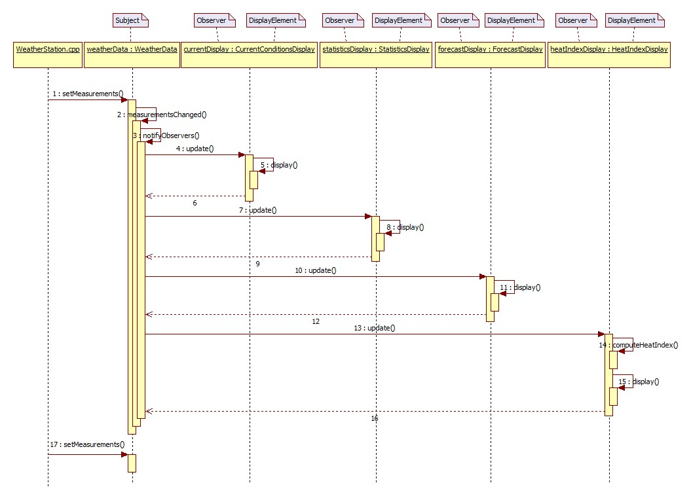

I want `Korean version <README.rst>`_.

****************
Observer Pattern
****************

+------------------------------------------------------------------------------+
|패턴 2. 옵저버                                                                |
+==============================================================================+
|한 객체의 상태가 바뀌면 그 객체에 의존하는 다른 객체들한테 연락이 가고        |
|자동으로 내용이 갱신되는 방식으로 일대다(one-to-many) 의존성을 정의한다.      |
+------------------------------------------------------------------------------+

+------------------------------------------------------------------------------+
|디자인 원칙                                                                   |
+==============================================================================+
|서로 상호작용을 하는 객체 사이에서는 가능하면 느슨하게 결합하는 디자인을      |
|사용해야 한다.                                                                |
+------------------------------------------------------------------------------+

Weather Station
===============

Class Diagram
-------------

.. image:: Content/Overview_of_WeatherStation.jpg
   :scale: 50 %
   :alt: Class Diagram

Sequence Diagram
----------------

