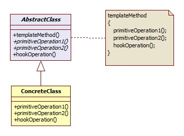

***********************
Template method Pattern
***********************

Barista
=======

Test
----

This project uses cmake so wide range of OSes are supported. For ubuntu, you can
compile as shown below::

 mkdir build
 cd build/
 cmake ../Barista/
 make
 ./driver/testbarista

Class Diagram
-------------

.. image:: Barista/imgs/Overview_of_Barista.jpg
   :scale: 50 %
   :alt: Class Diagram

Sequence Diagram
----------------

.. image:: Barista/imgs/SequenceDiagram1.jpg
   :scale: 50 %
   :alt: Sequence Diagram

+------------------------------------------------------------------------------+
|패턴 10. 템플릿 메소드                                                        |
+==============================================================================+
|메소드에서 알고리즘의 골격을 정의한다. 알고리즘의 여러 단계중 일부는          |
|서브클래스에서 구현할 수 있다. 템플릿 메소드를 이용하면 알고리즘의 구조는     |
|그대로 유지하면서 서브클래스에서 특정 단계를 재정의 할 수 있다.               |
+------------------------------------------------------------------------------+

잠깐 : 후크(hook)는 추상 클래스에서 선언되는 메소드이긴 하지만(위 패턴 정의
그림에서 Operation1(), Operation2() 처럼) 자바의 abstract 메소드 혹은 C++ 의 순수
가상함수처럼 그 바디가 없는 것이 아니라 기본적인 내용이 구현되어있거나 아무
내용이 없는 빈 메소드로 구현이 된 메소드 이다. 이렇게 하면 서브클래스 입장에서는
후크를 활용(오버라이드)해서 후크 메소드가 사용되는 지점에서 알고리즘에 끼어들 수
있게 된다. 물론 그냥 무시하고 넘어가도록 전략적으로 방치시킬 수도 있다.

+------------------------------------------------------------------------------+
|디자인 원칙 - 헐리우드 원칙                                                   |
+==============================================================================+
|먼저 연락하지 마세요. 저희가 연락 드리겠습니다.                               |
+------------------------------------------------------------------------------+

클래스들의 고수준과 저수준의 다단계의 계층 구조에서 고수준 구성요소가 저수준
구성요소에 의존하고 또, 저수준 구성요소도 아무런 제한없이 고수준 구성요소에
의존하며 고수준과 저수준의 각종 클래스들이 서로서로 의존관계가 무질서하게
얽혀있는 의존성 부페(dependency rot) 를 방지하기 위해서 헐리우드 원칙을 사용할 수
있다. 이 원칙을 사용하면 저수준 구성요소에서는 시스템에 접속을 할 수는 있지만,
언제 어떤 식으로 그 구성요소들을 사용할지는 고수준 구성요소에서 결정하게 된다.
즉, 고수준 구성요소에서 저수준 구성요소에게 "먼저 연락하지 마세요. 제가 먼저 연락
드리겠습니다." 라고 얘기를 하는 것과 같다.

헐리우드 원칙은 템플릿 메소드 패턴에서 눈에 확연히 드러나며, 팩토리 메소드 패턴과
옵저버 패턴 등 에서도 관찰할 수 있다.

