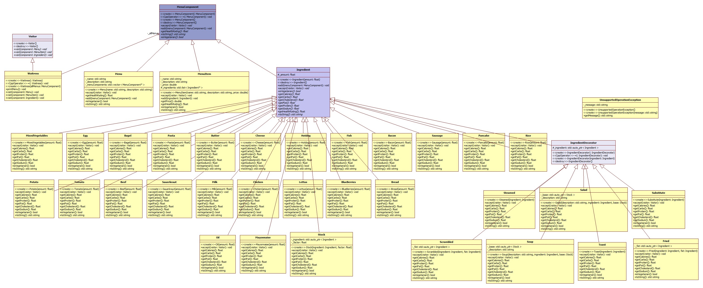

***************
Visitor Pattern
***************

Menus
=====

Class Diagram
-------------

Sequence Diagram
----------------

.. image:: Menus/SequenceDiagram1.jpg
   :scale: 50 %
   :alt: Sequence Diagram

+------------------------------------------------------------------------------+
|패턴 A. 비지터                                                                |
+==============================================================================+
|다양한 객체에 새로운 기능을 추가해야 하는데 캡슐화가 별로 중요하지 않은 경우  |
|사용한다.                                                                     |
+------------------------------------------------------------------------------+

.. image:: Visitor.jpg
   :scale: 50 %
   :alt: Class Diagram

